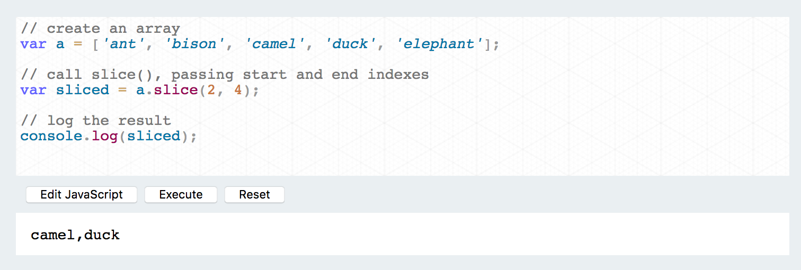
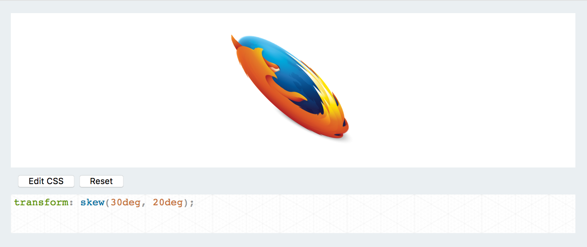
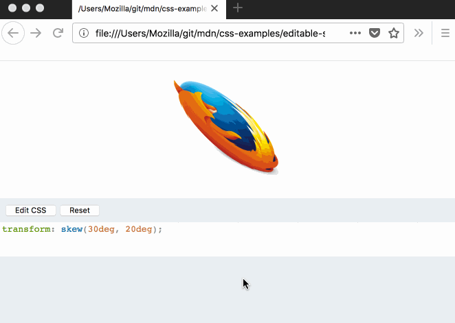
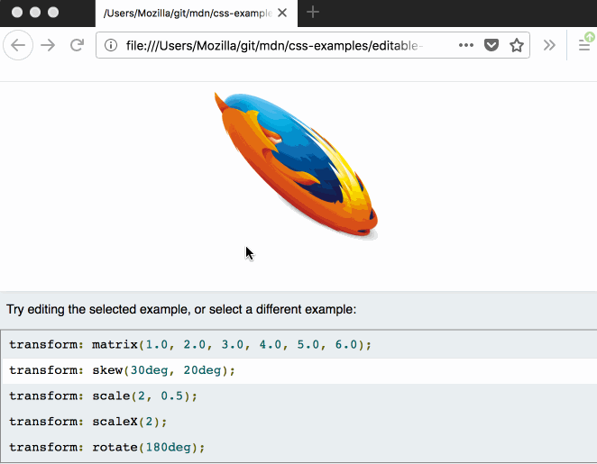
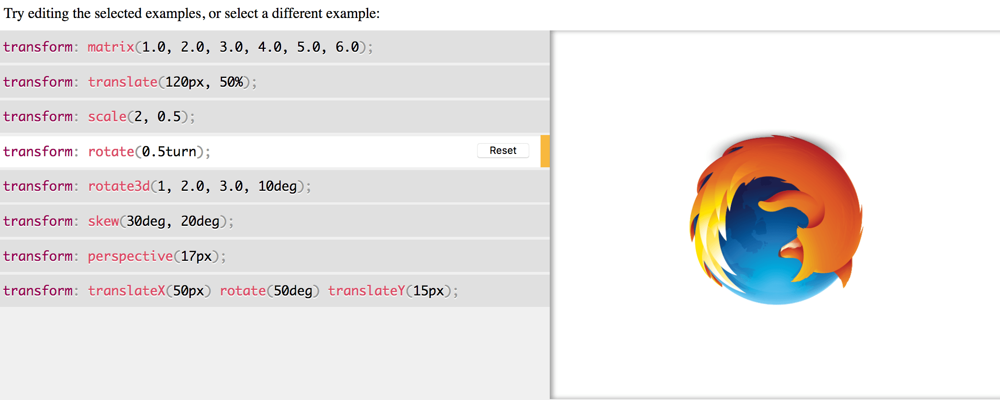
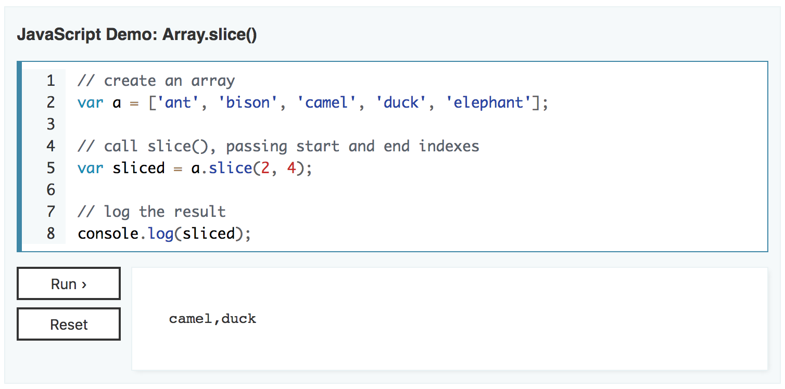
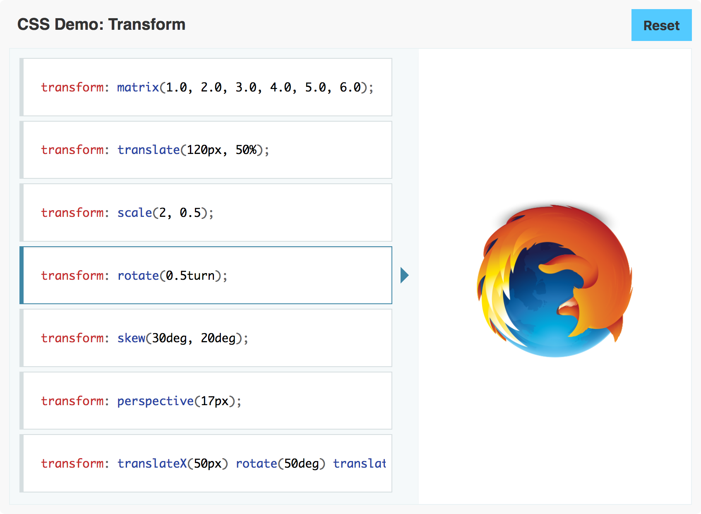

*"This is scoped to be a pretty small change."* - [me, January 2017](https://groups.google.com/d/msg/mozilla.dev.mdc/dhxwpNnlkSA/Vt7nnUFaEgAJ).

Over the last year and a bit, the [MDN Web Docs] team has been designing, building, and implementing interactive examples for our reference pages. The motivation for this was the idea that MDN should do more to help "action-oriented" users: people who like to learn by seeing and playing around with example code, rather than by reading about it.

We've just finished adding interactive examples for the JavaScript and CSS reference pages. This post looks back at the project to see how we got here and what we learned on the way.

## First prototypes

The project was first outlined in the [MDN product strategy](https://docs.google.com/presentation/d/1S5kyvJyt7OX5Xe41vdcQmG_iTrNtTR0paoRvrkKLH28/edit#slide=id.g13778398cd_2_0), published at the end of 2016. We discussed some ideas on the MDN mailing list, and the first prototypes looked something like this:

The CSS editor looked something like this:

We wanted the examples - especially the CSS examples - to show users the different kinds of syntax that an item could accept. In the early prototypes, we did this using autocomplete: when the user deleted the value assigned to a CSS property, we showed an autocomplete popup listing different syntax variations:

## First round of user testing

In March 2017 [Kadir Topal] and I attended the first round of user testing, which was run by [Mark Hurst]. We learned a great deal about user testing, about our prototypes, and about what users wanted to see. We learned that users  wanted examples and appreciated them being quick to find. Users liked interactive examples, too.

But autocomplete was not successful as a way to show different syntax forms. It just wasn't discoverable, and even people who did accidentally trigger it didn't seem to understand what it was for.

Especially for CSS, though, we still wanted a way to show readers the different kinds of syntax that an item can accept. For the CSS pages, we already had a PRE block in the pages that lists syntax options, like this:

    transform: matrix(1.0, 2.0, 3.0, 4.0, 5.0, 6.0);
    transform: translate(12px, 50%);
    transform: translateX(2em);
    transform: translateY(3in);
    transform: scale(2, 0.5);
    transform: scaleX(2);
    transform: scaleY(0.5);
    transform: rotate(0.5turn);
    transform: skew(30deg, 20deg);

One user interaction we saw, that we really liked, was when readers would copy lines from this PRE block into the editor, to see the effect. So we thought of combining this PRE block and the editor.

In this version, you can select a line from the block underneath, and the style is applied to the element above:

Looking back at this prototype now, two things stand out: first, the basic interaction model that we would eventually ship was already in place. Second, although the changes we would make after this point were essentially about styling, they had a dramatic effect on the editor's usability.

## Building a foundation

After that not much happened for a while, because our front-end developers were busy on other projects. [Stephanie Hobson] helped improve the editor design, but she was also engaged in a full-scale redesign of MDN's article pages. In June [Schalk Neethling] joined the team, dedicated to this project. He built a solid foundation for the editors and a whole new contribution workflow. This would be the basis of the final implementation.

In this implementation, interactive examples are maintained in the [interactive-examples](https://github.com/mdn/interactive-examples) GitHub repository. Once an interactive example is merged to the repo, it is built automatically as a standalone page served from a URL under https://interactive-examples.mdn.mozilla.net/. To include the example in an MDN page, we then embed the interactive example's document using an `iframe`.

## UX work and more user testing

At the end of June, we showed the editors to [Jen Simmons] and [Dan Callahan], who provided us some very useful feedback. The JS editor seemed pretty good, but we were still having problems with the CSS editor. At this point it looked like this:

People didn't understand that they could edit the CSS, or even that the left-hand side consisted of a list of separate choices rather than a single block.

Stephanie and Schalk did a full UX review of both editors. We also had an independent UX review from [Julia L-M] from the [Brigade]. After all this work, the editors looked like this:

Then we had another round of user testing. This time we ran remote user tests over video, with participants recruited through MDN itself. This gave us a tight feedback loop for the editors: we could quickly make and test adjustments based on user feedback.

This time user testing was very positive, and we decided we were ready for beta testing.

## Beta testing

The beta test started at the end of August and lasted for two weeks. We embedded editors on three JS and three CSS pages, added a survey, and asked for feedback. [Danielle Vincent] mentioned it in the [MDN newsletter], which drove thousands of people to [our Discourse post announcing it].

Feedback was overwhelmingly positive: 156/159 people who took the survey voted to see the editor on more pages, and the free-form text feedback was very encouraging. We were confident that we had a good UX.

## JavaScript examples and page load optimization 

Now we had an editor but very few actual examples. We asked [Mark Boas] to write examples for the JS reference pages, and in a couple of months he had written about 400 beautiful concise examples.

<iframe width="100%" height="490px" frameborder="0" src="https://interactive-examples.mdn.mozilla.net/pages/js/array-slice.html"></iframe>

We had another problem, though: it was clear that the editors regressed page load time too much. Schalk and Stephanie wrung every last millisecond of performance optimization out of the architecture, and finally, in December 2017, we decided to ship.

We have some extra tricks we plan to implement this year to continue improving page load performance, the fact is we're still not happy with current performance on interactive pages.

## CSS examples

In the first three weeks of 2018 Schalk and I updated 400 JavaScript pages to include Mark's examples, and then we turned to getting examples written for the CSS pages.

[We asked for help], [Jen Simmons tweeted about it], and three weeks later [our community had contributed more than 150 examples], with over a hundred coming from a single volunteer, [mfluehr].

<iframe width="100%" height="390px" frameborder="0" src="https://interactive-examples.mdn.mozilla.net/pages/css/rotate3d.html"></iframe>

After that [Rachel Andrew] and [Daniel Beck] started working with us, and they took care of the rest.

<iframe width="100%" height="390px" frameborder="0" src="https://interactive-examples.mdn.mozilla.net/pages/css/clip-path.html"></iframe>

## What's next?

Right now we're working on implementing interactive examples for the [HTML reference](https://developer.mozilla.org/en-US/docs/Web/HTML/Reference). We have just finished a round of user testing, with [encouraging results](This text uses the Verdana font (10px), and hope to start writing examples soon.

To get this far, the project has been shaped by many people contributing a wide range of different skills. If you'd like to help out with the project, please check out the [interactive-examples repo] and the [MDN Discourse forum], where we regularly announce updates.
